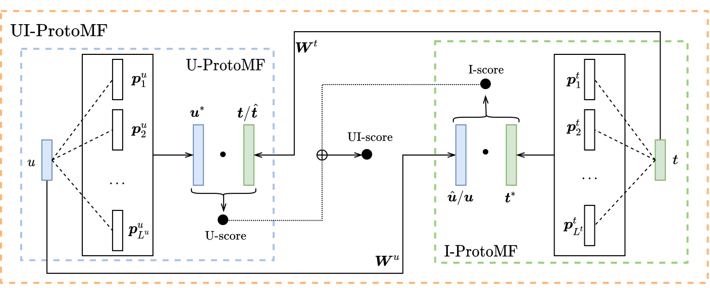

# ProtoMF: Prototype-based Matrix Factorization for Effective and Explainable Recommendations

このリポジトリには、RecSys 2022で発表された論文「ProtoMF: Prototype-based Matrix Factorization for Effective and Explainable Recommendations」（著者： Alessandro B. Melchiorre、Navid Rekabsaz、Christian Ganhör、Markus Schedl）のコードおよび追加資料が含まれています。



```latex
@inproceedings{melchiorre2022protomf,
    title = {ProtoMF: Prototype-based Matrix Factorization for Effective and Explainable Recommendations},
    author = {Melchiorre, Alessandro B. and Rekabsaz, Navid and Ganhör, Christian and Schedl, Markus},
    booktitle = {Sixteenth ACM Conference on Recommender Systems},
    year = {2022},
    publisher = {Association for Computing Machinery},
    address = {New York, NY, USA},
    series = {RecSys '22},
    doi = {10.1145/3523227.3546756},
    isbn = {978-1-4503-9278-5/22/09}
}
```

## Repository Structure
このコードはPythonで書かれており、[Pytorch](https://pytorch.org/) を使用してモデルの勾配を計算します。また、[ray tune](https://www.ray.io/ray-tune) を用いたハイパーパラメータ最適化や、[weight and biases](https://wandb.ai/)を用いたログ記録など、多くの便利なパッケージを活用しています。

**Code**は以下のように構成され、それぞれ簡単に説明されています。


```bash
.
├── confs
│   └── hyper_params.py
├── data
│   ├── amazon2014
│   │   └── amazon2014_splitter.py
│   ├── lfm2b-1mon
│   │   └── lfm2b-2020_splitter.py
│   ├── ml-1m
│   │   └── movielens_splitter.py
│   └── README.md
├── experiment_helper.py
├── feature_extraction
│   ├── feature_extractor_factories.py
│   └── feature_extractors.py
├── pdfs and images
│   ├── protomf_appendix.pdf
│   ├── protomf_diagram.png
│   └── ProtoMF__Prototype_based_Matrix_Factorization.pdf
├── protomf.yml
├── README.md
├── rec_sys
│   ├── protomf_dataset.py
│   ├── rec_sys.py
│   ├── tester.py
│   └── trainer.py
├── start.py
└── utilities
    ├── consts.py
    ├── eval.py
    └── utils.py
```

ファイルおよびディレクトリの役割は以下の通りです：

- `start.py`: 実験の起点となるスクリプト(`python start.py --help`)
- `experiment_helper.py`: ハイパーパラメータ最適化処理
- `confs/hyper_params.py`: 各モデルのハイパーパラメータ
- `data/*`: データフォルダおよびデータ分割コード
- `feature_extraction/*`: モデルに関連するコード
- `rec_sys/protomf_dataset.py`: データセットの処理（ネガティブサンプリングを含む）
- `rec_sys/rec_sys.py`: すべてのモデルで使用される推薦システムコード
- `rec_sys/tester.py` and `rec_sys/trainer.py`: テストおよびトレーニング
- `utilities/*`: 定数、評価指標、汎用コード

## インストールおよび設定

### 環境構築

- `ProtoMF_github.ipynb`を実行すれば環境構築ができます。依存関係の競合が起こりますが、実行に支障はないです。

### データ
`./data/README.md`に記載された手順に従い、3つのデータセットをすべてダウンロードしてください。データセットのファイルを適切なフォルダに配置し、それぞれのsplitter.pyファイルを使用してデータセットを前処理します。
データを前処理するには、通常以下を実行します：

- 該当フォルダに移動します：`cd <dataset_folder>`
- 次のコマンドを実行します：
`python <dataset_name>_splitter.py -lh <folder_where_the_data_is>`
（データがすでにそのフォルダにある場合、通常`./`で十分です）
スクリプトの実行後、以下の5つのファイルが生成されます：

- ユーザーのリスニング履歴（train、val、test用）の3つのファイル
- レーティング行列のインデックスとして機能するユーザーおよびアイテムIDを含む2つのファイル


### 設定

`utilities/consts.py`で以下を設定する必要があります：

- `DATA_PATH`: `./data`フォルダへの絶対パス
- `WANDB_API_KEY`: Weight and BiasesのAPIキー（詳細の結果は現在ここにのみ記録されます）


## Run

実験は以下のコマンドで開始できます：

`python start.py -m <model> -d <dataset>`

モデルおよびデータセットの選択肢を確認するには以下を使用してください：

`python start.py --help`

デフォルトでは、`python start.py`は単一のシードでハイパーパラメータ最適化を実行します（詳細は`utilities/consts.py`を参照）。
`-mp`フラグをモデルおよびデータセットと共に指定すると、3回のハイパーパラメータ最適化を実行し、テスト結果を平均化します。

結果および進捗はWeight & Biasesのウェブページで確認可能です。

## ライセンス
このリポジトリ内のコードはApache 2.0ライセンスの下で提供されています。詳細はLICENSEファイルをご覧ください。