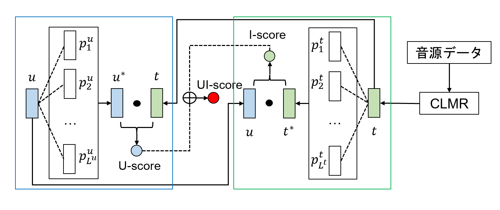

# ProtoMF: Prototype-based Matrix Factorization for Effective and Explainable Recommendations

このリポジトリには、「ProtoMFを用いた音楽推薦と推薦過程の可視化」のコードおよび追加資料が含まれています。



```latex
@inproceedings{
    title = {ProtoMFを用いた音楽推薦と推薦過程の可視化},
    author = {Yusuke Okahata, Yusuke Shimizu, Keiko Ono},
    booktitle = {},
    year = {2025},
    publisher = {},
    address = {Kyoto,Japan},
    series = {},
    doi = {},
    isbn = {}
}
```

## Repository Structure
このコードはPythonで書かれており、[Pytorch](https://pytorch.org/) を使用してモデルの勾配を計算します。また、[ray tune](https://www.ray.io/ray-tune) を用いたハイパーパラメータ最適化や、[weight and biases](https://wandb.ai/)を用いたログ記録など、多くの便利なパッケージを活用しています。

**Code**は以下のように構成され、それぞれ簡単に説明されています。


```bash
.
├── confs
│   └── hyper_params.py
├── data
│   ├── amazon2014
│   │   └── amazon2014_splitter.py
│   ├── lfm2b-1mon
│   │   ├── lfm2b-2020_splitter.py
│   │   └── lfm2b-2020_splitter_reduce_ver.py
│   ├── ml-1m
│   │   └── movielens_splitter.py
│   └── README.md
├── experiment_helper.py
├── explanations_util.ipynb
├── feature_extraction
│   ├── feature_extractor_factories.py
│   └── feature_extractors.py
├── pdfs and images
│   ├── protomf_appendix.pdf
│   ├── proposed_model.png
│   └── ProtoMF__Prototype_based_Matrix_Factorization.pdf
├── README.md
├── rec_sys
│   ├── protomf_dataset.py
│   ├── rec_sys.py
│   ├── tester.py
│   └── trainer.py
├── start.py
└── utilities
    ├── consts.py
    ├── eval.py
    └── utils.py
```

ファイルおよびディレクトリの役割は以下の通りです：

- `start.py`: 実験の起点となるスクリプト(`python start.py --help`)
- `experiment_helper.py`: ハイパーパラメータ最適化処理
- `explanations_util.ipynb`:推薦過程の可視化など説明性に関するコード
- `confs/hyper_params.py`: 各モデルのハイパーパラメータ
- `data/*`: データフォルダおよびデータ分割コード
- `feature_extraction/*`: モデルに関連するコード
- `rec_sys/protomf_dataset.py`: データセットの処理（ネガティブサンプリングを含む）
- `rec_sys/rec_sys.py`: すべてのモデルで使用される推薦システムコード
- `rec_sys/tester.py` and `rec_sys/trainer.py`: テストおよびトレーニング
- `utilities/*`: 定数、評価指標、汎用コード

## インストールおよび設定

### 環境構築

- `ProtoMF_github.ipynb`を実行すれば環境構築ができます。依存関係の競合が起こりますが、実行に支障はないです。

### データ
`./data/README.md`に記載された手順に従い、3つのデータセットをすべてダウンロードしてください。データセットのファイルを適切なフォルダに配置し、それぞれのsplitter.pyファイルを使用してデータセットを前処理します。
データを前処理するには、通常以下を実行します：

- 該当フォルダに移動します：`cd <dataset_folder>`
- 次のコマンドを実行します：
`python <dataset_name>_splitter.py -lh <folder_where_the_data_is>`
（データがすでにそのフォルダにある場合、通常`./`で十分です）
スクリプトの実行後、以下の5つのファイルが生成されます：

- ユーザーのリスニング履歴（train、val、test用）の3つのファイル
- レーティング行列のインデックスとして機能するユーザーおよびアイテムIDを含む2つのファイル


### 設定

`utilities/consts.py`で以下を設定する必要があります：

- `DATA_PATH`: `./data`フォルダへの絶対パス
- `WANDB_API_KEY`: Weight and BiasesのAPIキー（詳細の結果は現在ここにのみ記録されます）


## Run

実験は以下のコマンドで開始できます：

`python start.py -m <model> -d <dataset>`

モデルおよびデータセットの選択肢を確認するには以下を使用してください：

`python start.py --help`

デフォルトでは、`python start.py`は単一のシードでハイパーパラメータ最適化を実行します（詳細は`utilities/consts.py`を参照）。
`-mp`フラグをモデルおよびデータセットと共に指定すると、3回のハイパーパラメータ最適化を実行し、テスト結果を平均化します。

結果および進捗はWeight & Biasesのウェブページで確認可能です。

## 推薦説明

推薦過程の可視化など、説明性に関しては以下のファイルの中身に従って実行してください：
`explanations_util.ipynb`

## ライセンス
このリポジトリ内のコードはApache 2.0ライセンスの下で提供されています。詳細はLICENSEファイルをご覧ください。